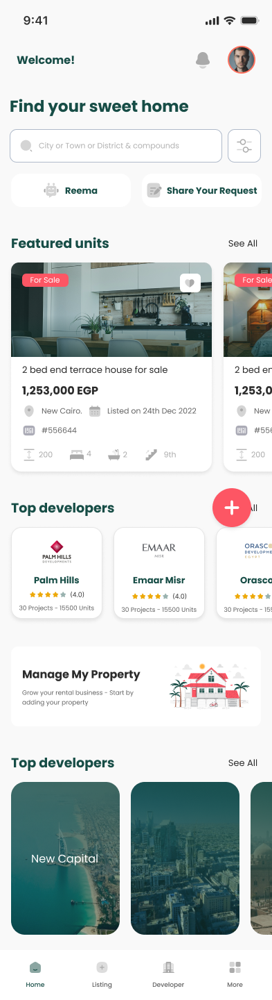
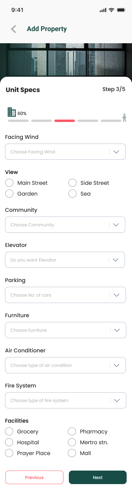
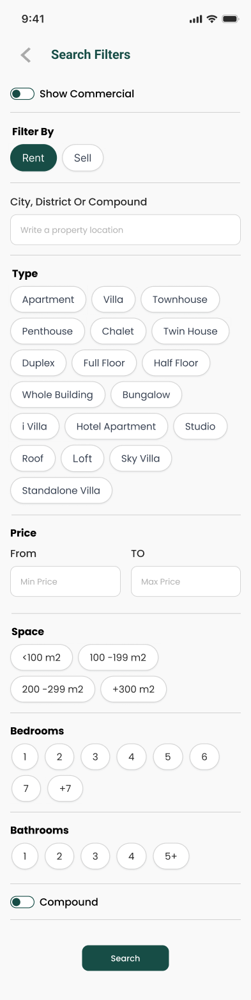

# Alaaqar App

This repository showcases the development of the Alaaqar mobile application, designed to simplify property transactions in the UAE, KSA, and Egypt.

<table align="center">
  <tr>
    <td></td>
    <td></td>
    <td></td>
  </tr>
</table>

## Overview

Alaaqar Connect aims to revolutionize property transactions by providing a seamless platform for buying, selling, and renting residential and commercial properties. Powered by AI, our app offers a user-friendly interface to connect buyers with their dream homes and assist sellers in finding the right consumers.

## Features

1. **Property Search:**
   - Easily find residential and commercial properties using intuitive search filters (location, price range, property type).

2. **AI-Powered Recommendations:**
   - Receive personalized property recommendations based on user preferences and search history.

3. **Property Listings:**
   - Detailed property listings with high-quality images, floor plans, and essential property information.

4. **Seller Dashboard:**
   - List properties for sale or rent, manage inquiries, and track performance through a personalized dashboard.

5. **Buyer Alerts:**
   - Receive notifications when new properties matching your criteria become available.

6. **Virtual Tours:**
   - Explore properties through immersive 360-degree virtual tours.

7. **Property Valuation:**
   - Get an estimate of property value using our valuation tool.

8. **Legal Assistance:**
   - Access legal resources and guidance related to property transactions.

9. **Community Insights:**
   - Learn about neighborhoods, amenities, and local facilities near each property.

10. **Responsive Customer Support:**
    - Reach out to our support team for queries or assistance.

## Technologies Used

The technology stack for the Alaaqar App includes:

- **State Management:** [Bloc](https://pub.dev/packages/flutter_bloc), [Hydrated Bloc](https://pub.dev/packages/hydrated_bloc)
- **Networking:** [Dio](https://pub.dev/packages/dio)
- **Navigation:** [Go Router](https://pub.dev/packages/go_router)

Please note that this list is subject to expansion as the project evolves and additional technologies are integrated.

## Installation

Alaaqar is currently in the early phases of development. The app will be available for review upon completion.

## Links

- [Alaaqar Website](https://eg.alaaqar.com/en/home?q=buy)
